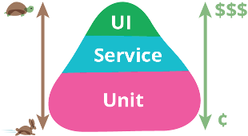
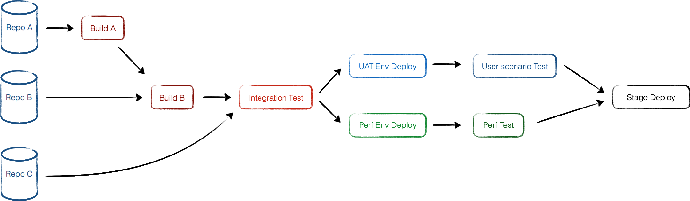

# Key Takeaway Points for a Full-spectrum CI/CD Solution
2017-02-06

During my time at ThoughtWorks, sometimes I acted as a CI expert and provided CI/CD solution to several clients. My guess is I won't do it anymore, so I dump these things from my memory here, and may even be helpful for you.

## CD Pipeline

The core concept behind CI/CD is **pipeline**, which I believe is also the core concept behind all software project management.

Pipeline for CD is pretty much like a water hose, instead of water, it has features, bug fixes, and user stories inside. By building a robust pipeline it ensures the code flow from code repositories to production environment safely and efficiently.

So I'll begin with code repositories.

## Branch Model
You may don't need to choose your SCM tool since Git is ubiquitous these days, but you still need to choose your branch model. If you enjoy complexity and like everything in its own place, consider [Gitflow](http://nvie.com/posts/a-successful-git-branching-model/). If you cannot tolerant that level of complexity, there are dozens of simplified version out there. The one I favor the most is Truck Based Development, that is, (almost) no branches anymore, at least no more feature branches - use [feature toggles](https://en.wikipedia.org/wiki/Feature_toggle) instead.

Branches are evil because the moment you fork a branch signifies sometime in the future you need to merge it back, And the longer the branch lives, the more pain you will get when you do the merge. Even if you manage to resolve all the conflicts and compile successfully, it's still hard to confidently say there no conflicts or missing pieces in business logic level.

Besides, branches prevent team members from sharing each other's code in time. Imagine you do some refactoring on your branch for a while and you want to merge another branch later on - it's just a disaster.

Feature branches seem to be a good feature management tool at first glance - each feature corresponds to a specific branch which you can fork/merge/delete at will, however they are not independent from each other in code level. It's very easy to mess up your source code while you have a bunch of branches merge from/to each other, and it's exhausting to keep in mind which branch currently working on. In a word, branches are insufficient to model features and we should move that complexity to somewhere complex enough and mature enough, and that is source code, using feature toggles.

Remember why we do CI in the first place? Integrate sooner so you can detect errors quickly and locate them more easily. Branches especially long-lived branches go against this beautifully. So the rule of thumb is this: Avoid long-lived branches, if you have to, merge them back as often as possible.

### Everything as Code
If you have never heard of `Infrastructure as Code`, think about `Puppet`, `Ansible`, or AWS `CloudFormation`. Not just infrastructure, `Dockerfile`, `package.json`, `Jenkinsfile`, `Flyway`, nowadays almost every mature software and platform for software development provides APIs to interact with and text format file to describe domain model and configurations

By reshaping everything into code, you can put them into code repositories and every change becomes traceable. By checkout the specific version, you should be able to regenerate build artifacts, regain dependencies, reprovision infrastructure, etc.

### CI Disciplines
Continous Integration is a development practice, thus requiring all team members obey certain rules:
  - Every code commit should be atomic and with meaningful message
  - Run all tests locally before push your code to centric repositories
  - Pull frequently, push frequently, don't pile up too many commits locally, take small steps forward
  - Fix CI build failures should be number 1 priority, and don't leave it broken overnight (especially for distributed teams).If you cannot fix CI in time, revert it!

## Test strategy
Some Agile evangelists have developed a theory called TestPyramid which vividly depicts different levels of tests and their relationship and characteristics.

(comes from Martin Fowler's blog)

As we can see Unit tests are fastest and lowest cost while UI tests are slow, expensive, fragile and hard to maintain. So we should have more UT to cover more cases and scenarios, let UT provide most timely feedback on CI and act as the primary security guard.

Nowadays, as more and more services have well-defined APIs and maintain relatively small sizes, I think a comprehensive set of API tests are quite efficient and doable, let UT just cover core algorithms.

NFR tests like performance tests should be put on CI too if these kinds of metrics are crucial to your system. The underlying environment NFR tests run on must be independent with normal tests environment, which may incur some extra effort of environment management.

## Configuration Management
First of all, like I said before, you should put configurations into SCM, make it traceable. For a mature CD pipeline, software packages on multiple environments for the same version should be identical, only configuration differs. In this way, you don't need to build the same SCM revision twice, and more importantly, your confidence in that package get cumulated as it passes more pipeline stages.

## More about CI pipelines
A common pitfall about pipelines is lack of maintenance. As the project goes on, we tend to put more and more stuff into pipelines due to its automatic nature, make it slow and inefficient. If we cannot get timely feedback from CI, it soon becomes a bottleneck for every team member.

Purchase better hardware, review and clear out obsolete tests, make independent steps run in parallel are common tactics to shorten pipeline duration. The most important is keep the shape of CI in mind, think twice before you shout "Hey! You take it over!" and throw something to CI.

### Pipeline Orchestration
If you have many repositories and their build artifacts depend on each other, or one pipeline carries too many jobs, you might consider arrange, reorganize, split, coordinate steps/job of pipelines, make it correspond to service dependencies and less time-consuming. That's pipeline orchestration.

As shown in the picture, artifacts of `Repo B` depends on `Repo A`, changes from both `Repo A` and `Repo B` will trigger the whole pipeline, but if someone commits to `Repo B`, `Repo A` will not get built. And also, changes of integration test cases in `Repo C` induce Integration test and following stages rerun, but leaving `Build A` and `Build B` intact.

Both User Scenario Test and Perf Test are time-consuming and they are independent from each other, so we let them run in parallel. Unit Tests and Integration Tests are faster, cover more details hence more easily to fail, so we put them in early stages.

## Artifacts & Dependency Management
Needless to say, you should install proprietary npm server, docker registry server, gem server etc, or SaaS services on the cloud to store, cache and versionize these things. And never commit build artifacts or depending artifacts to code repository: they are huge, cannot be version controlled if binary, and once you put in you can never get it out for a distributed SCM like Git[1].

## Environment Management
First of all, consider Infrastructure as Code, like I said in my [previous post](ansible-pitfalls.md) it's hard and definitely not silver bullet, but it might be the best bad option to avoid your infrastructure being messed up. Every change to infrastructure should be trackable and manageable, and infrastructure of test environment should be as close to production environment as possible.

One of my former colleagues at ThoughtWorks once put forth an idea: Publish to production environment on day one. It's a very bold idea and seems unnecessary at first glance, but as you put more thought into, you realize it's not just an aggressive expansion of CD, it's a perfect way to assess infrastructure. During my time at ThoughtWorks I've worked on several domestic projects whose clients are traditional companies, and it costs you endless hours to request all kinds of resources to keep the whole project going like VMs, VMs with specified OSes, firewalls, authentications of depending services etc. By practicing this idea, you would be able to identify these hindrances at early stages and give you enough time to clear the shit out of the way.

## Deployment & Release Strategy
It used to be scary and stressful to release a new version to production environment. I remember when I was working my first job after graduation, sometimes we all went out for a big meal and drank some when a big release was scheduled that night. These kinds of release styles should be avoided since you don't have full control over what's happening and what's gonna happen during operation, hence easier something goes wrong.

Deployment and Release process should be fully automated, happens relatively frequently, each time with a small batch of changes, take small steps forward. Nonetheless Rome was not built in a day, such sweet things require mature CD pipelines, good auto test coverage, and comprehensive combination of manual test and auto test. You might also want to achieve hot deployment for your CD pipeline, Blue Green Deployments is an option and k8s has it built-in as Rolling Updates.

## High Traceability
Whether you are building an all-in-one CD platform from scratch or assemble one from various open source projects, what contributes to usability largely is traceability, that is, whether the platform can help and accelerate developers locate bugs if build fails. It includes:
  - Parse XML JUnit report and display neatly on Web page
  - Associate each build with corresponding code commit on UI. When subsequent stages of a pipeline fail, one click on UI will show its related commits, authors, and commit messages.
  - For complex pipeline orchestrations, the developer should be able to trace all downstream pipeline builds for a specific code change, and trace all upstream and downstream pipeline builds for a specific pipeline build on UI.
  - When build fails, sometimes developers might need to log into that build machine to debug on the scene. So the Environment Management part of the platform should be able to preserve criminal scenes of every failed build for a while.

## Monitoring & Visualization
Like all software systems, feedback mechanism is an essential part for a CD platform too. Infrastructure resource monitoring like CPU usages, memory usages, and disk usages is the same as normal systems, Prometheus with Grafana is the most popular solution while I am working on this post.

Specifically for CI/CD, at first we must have a CI wall displaying basic red & green for every pipeline stage besides developers' desk, then a detailed dashboard from administrative perspective might be needed, which includes code commit frequency per day, builds frequency and success ratio, code static check metrics, deployment & release frequency and durations etc.

The pitfall here is using CD dashboard as an administrative tool to measure developer commitment and productivity. There are a thousand ways to get around it and fool these metrics, and it hurts productivity and the trust between leaders and developers, just don't do it.

## The Most Important
It's not difficult to bring all state of the art DevOps technologies and practices together then generate a fancy solution report, the thing is the solution must be pragmatic according to client's current situation. No silver bullet here but a lot of interviews, a lot of digging, a lot of tradeoffs between administration requirements and efficiency. Finally bring about a roadmap constitutes doable steps and measurable milestones, which hopefully will guide them to the heaven.

## Verification
After spending a lot of time and money practicing all the stuff above, how do we know if it's worth it? 

- Does the quality improved?
- Does the cost of every release get reduced? The cost may include time, human resource, and psychological stress of every team member.

 

---
[1] You can actually, in hacky way, but it's discouraged since you have to `git push -f` in the end.

